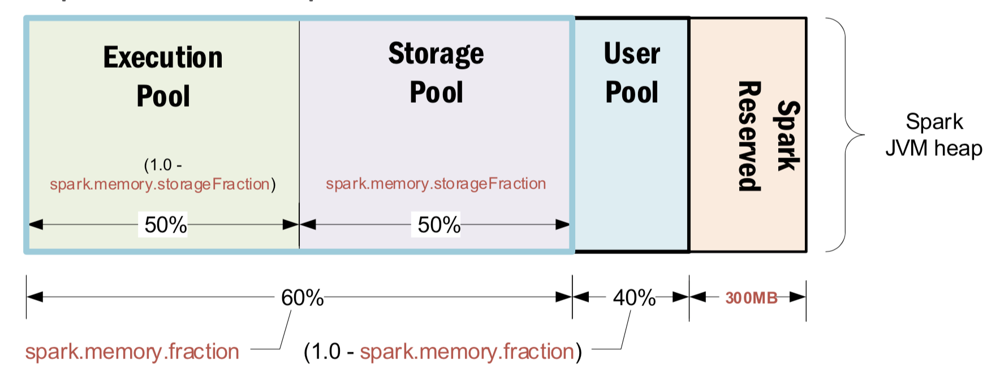

Doc-Spark
- [FAQ](#faq)
- [Mem Layout](#mem-layout)
- [Memory Management](#memory-management)
- [Out of Memory (OOM)](#out-of-memory-oom)

## FAQ
 * How to handle OOM issues?
   * See [Memory Management](#memory-management)
 * [Shuffle operations](https://spark.apache.org/docs/latest/rdd-programming-guide.html#shuffle-operations)
   * In Spark, data is generally not distributed across partitions to be in the necessary place for a specific operation. During computations, a single task will operate on a single partition
   * Thus, to organize all the data for a single reduceByKey reduce task to execute, Spark needs to perform an all-to-all operation. It must read from all partitions to find all the values for all keys, and then bring together values across partitions to compute the final result for each key - this is called the shuffle.
   * Example:
     * **Repartition** operations
       * repartition, coalesce
     * **ByKey** operations
       * groupByKey, reduceByKey
     * **Join** operations
 * Memory Overhead
   * Sometimes it's not the executor memory, rather its the YARN container memory overhead that causes OOM or the node gets killed by YARN. “YARN kill” messages typically look like this:
     * [pid=<pid>,containerID=[contained_ID] isrunningbeyondphysicalmemorylimits. Currentusage: 1.5 GBof 1.5 GBphysicalmemoryused; 4.6 GBof 3.1 GBvirtualmemoryused. Killingcontainer
   * YARN runs each Spark component like executors and drivers inside containers. **Overhead memory is the off-heap memory used for JVM overheads, interned strings, and other metadata in the JVM**. In this case, you need to configure spark.yarn.executor.memoryOverhead to a proper value. **Typically, 10 percent of total executor memory should be allocated for overhead.**


## Mem Layout
* Overview
  * 
  * Spark Resevered
    * Reserved for storing spark interval objects
    * 300MB, hardcode
  * User Data Pool
    * User Code
    * User object (List, Array, RDD, DataFrame)
  * Execution Pool
    * Execution memory refers to that used for computation in **shuffles, joins, sorts and aggregations**
    * **Never evict** during its life cycle
  * Storage Pool (cache)
    * Used by Spark Core operation
    * Storage memory refers to that used for caching and propagating internal data across the cluster
    * **cache(), persist(). broadcast()**
    * **May be evicted** during its life cycle

## Memory Management
* Coding:
  * Use **partial load** and **filter** to reduce data size.
  * Use write.partitionBy + external storage (e.g. HDFS) and hadoop cmd to collect data.
    * for example:
      * **write.partitionBy()** to replace **persist() + filter()**
      * memory efficient
        ```python
        df.write.partitionBy('col1',
                             'col2',
                             .mode("overwrite").text(file_path)
        ```
      * not memory efficient
        ```python
        df.persist()
        df_col1op1 = df.filter(fn.col('col1') == optiona1).persist()
        df_col1op1.filter(fn.col('col2') == optiona1).mode("overwrite").text(file_path_1)
        df_col1op1.filter(fn.col('col2') == optiona2).mode("overwrite").text(file_path_2)
        ```
  * **Use shuffle operations carefully** (prevent to use if possible).
    * example:
      * Use filter to replace anti join.

* Configuration:
  * Driver:
    * spark.driver.memory
    * spark.driver.memoryOverhead (JVM overhead)
  * Executor:
    * spark.executor.memory
    * spark.executor.memoryOverhead (JVM overhead)
  * Memory Fraction
    * spark.memory.fraction
      * example: 0.6
        * 60% for Execution Pool and Storage Pool
        * 40% for User Pool
    * spark.memory.storageFraction
      * example: 0.6
        * 60 % for Storage Pool (cache)
        * 40 % for Execution Pool

## Out of Memory (OOM)
* Ref:
  * https://dzone.com/articles/common-reasons-your-spark-applications-are-slow-or

* OOM at the Driver Level
  * Spark is an engine to distribute the workload among worker machines. The driver should only be considered as an orchestrator.
  * Common causes which result in driver OOM:
    * collect (rdd.collect() , df.collect())
    * sparkContext.broadcast
    * Low driver memory configured
* OOM at the Executor Level
  * High concurrency
  * Inefficient queries
* OOM at NodeManager
  * When Spark's external shuffle service is configured with YARN, NodeManager starts an auxiliary service which acts as an external shuffle service provider. By default, NodeManager memory is around 1 GB. However, applications which do heavy data shuffling might fail due to NodeManager running out of memory.


